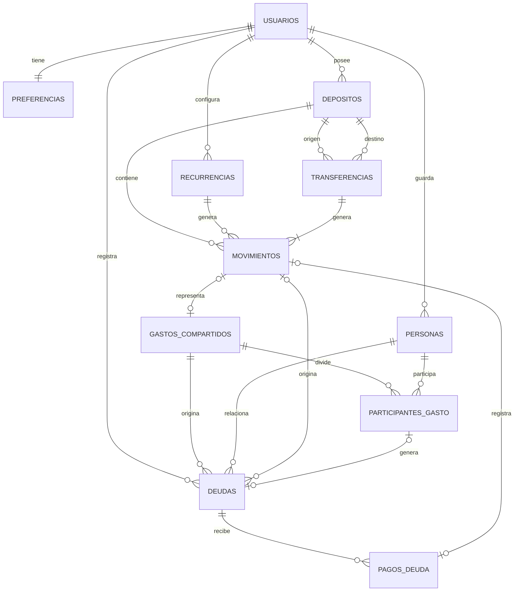
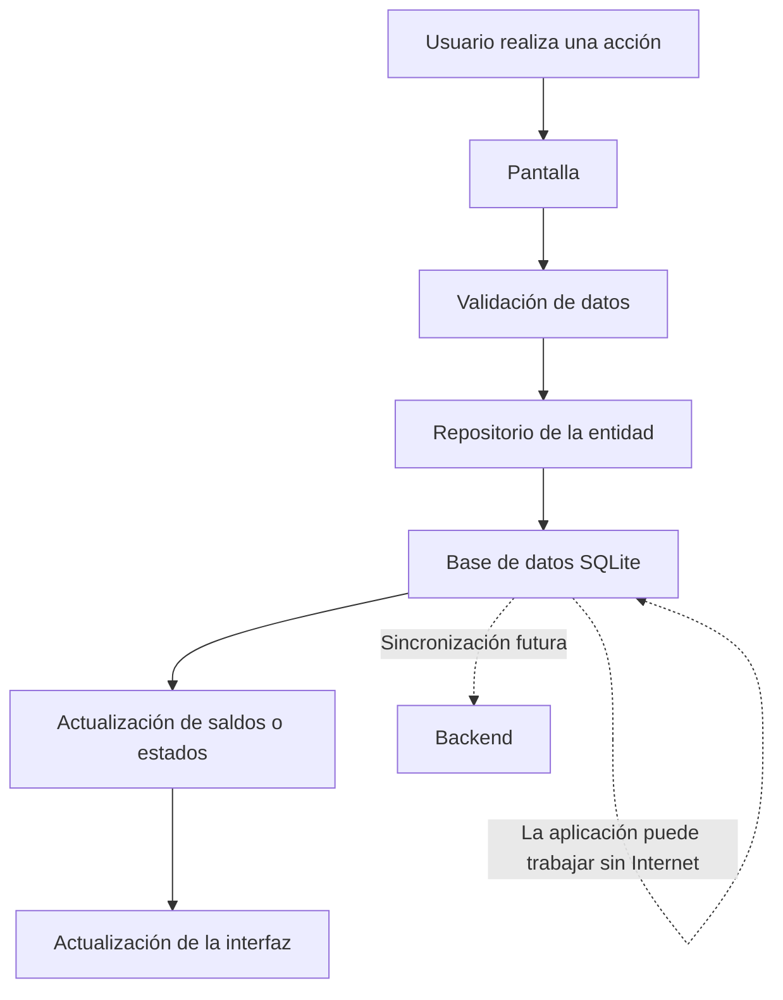

# Base de datos local de AHRE

## Objetivo

AHRE utiliza un enfoque offline-first. Las operaciones financieras principales deben poder realizarse sin conexión a Internet y la información debe guardarse localmente antes de considerar cualquier comunicación con un backend.

El flujo general será:

```text
usuario realiza una operación
→ AHRE valida la información
→ se guarda en SQLite
→ se actualizan los saldos o estados relacionados
→ la interfaz muestra el resultado
```

Este documento define la tecnología y el modelo inicial. La implementación del CRUD de cada entidad se realizará en los Issues correspondientes.

## Tecnología seleccionada

La persistencia principal será `expo-sqlite`.

La elección se debe a que AHRE necesita:

- almacenar información relacionada;
- consultar movimientos por depósito, categoría y fecha;
- calcular saldos;
- trabajar sin conexión;
- conservar los datos entre reinicios de la aplicación;
- dejar preparada una futura sincronización.

`expo-secure-store` se utilizará únicamente para datos sensibles pequeños, como tokens o credenciales de sesión. No se utilizará para guardar movimientos, depósitos o deudas.

No se utilizará `AsyncStorage` como base principal porque el modelo de AHRE necesita relaciones y consultas estructuradas.

## Convenciones de la base de datos

- Los nombres de tablas y campos estarán en español.
- Se utilizará `snake_case`.
- No se utilizarán tildes ni caracteres especiales en nombres de tablas o campos.
- Los identificadores serán textos generados localmente.
- Los montos utilizarán el campo `monto` sin agregar campos adicionales de centavos.
- Las fechas se guardarán como texto en formato ISO 8601.
- Las tablas financieras no se eliminarán físicamente cuando se necesite conservar el historial.

Ejemplos:

```text
depositos
fecha_creacion
deposito_id
monto
```

## Entidades principales

### `usuarios`

Representa al usuario local de AHRE.

| Campo | Tipo | Descripción |
| --- | --- | --- |
| `id` | `TEXT` | Identificador local del usuario. |
| `nombre` | `TEXT` | Nombre visible del usuario. |
| `correo_electronico` | `TEXT` | Correo del usuario, si corresponde. |
| `activo` | `INTEGER` | Indica si el usuario está activo. |
| `fecha_creacion` | `TEXT` | Fecha de creación. |
| `fecha_actualizacion` | `TEXT` | Última modificación. |

### `preferencias`

Guarda las preferencias básicas del usuario.

| Campo | Tipo | Descripción |
| --- | --- | --- |
| `id` | `TEXT` | Identificador local. |
| `usuario_id` | `TEXT` | Usuario al que pertenecen las preferencias. |
| `deposito_predeterminado_id` | `TEXT` | Depósito utilizado por defecto. |
| `notificaciones_activas` | `INTEGER` | Indica si las notificaciones están activas. |
| `fecha_creacion` | `TEXT` | Fecha de creación. |
| `fecha_actualizacion` | `TEXT` | Última modificación. |

Cada usuario tendrá como máximo un registro de preferencias.

### `depositos`

Representa los lugares donde el usuario tiene dinero.

| Campo | Tipo | Descripción |
| --- | --- | --- |
| `id` | `TEXT` | Identificador local. |
| `usuario_id` | `TEXT` | Usuario propietario. |
| `nombre` | `TEXT` | Nombre del depósito. |
| `tipo` | `TEXT` | `efectivo`, `banco` o `billetera_virtual`. |
| `saldo_inicial` | `REAL` | Saldo con el que se crea el depósito. |
| `icono` | `TEXT` | Identificador del ícono utilizado. |
| `color` | `TEXT` | Color opcional del depósito. |
| `descripcion` | `TEXT` | Descripción opcional. |
| `activo` | `INTEGER` | Indica si acepta nuevos movimientos. |
| `fecha_creacion` | `TEXT` | Fecha de creación. |
| `fecha_actualizacion` | `TEXT` | Última modificación. |

Un depósito solamente tiene un tipo. No tiene categorías asociadas. Las
categorías se utilizan en los movimientos que afectan al depósito.

El saldo actual no se guardará como fuente principal. Se calculará a partir del saldo inicial y sus movimientos.

```text
saldo actual = saldo inicial + ingresos - egresos
```

### `movimientos`

Representa ingresos, egresos y los movimientos generados por una transferencia.

| Campo | Tipo | Descripción |
| --- | --- | --- |
| `id` | `TEXT` | Identificador local. |
| `deposito_id` | `TEXT` | Depósito afectado. |
| `categoria` | `TEXT` | Categoría definida en el enum de movimientos. |
| `recurrencia_id` | `TEXT` | Recurrencia relacionada, si corresponde. |
| `transferencia_id` | `TEXT` | Transferencia relacionada, si corresponde. |
| `tipo` | `TEXT` | `ingreso`, `egreso`, `transferencia_salida` o `transferencia_entrada`. |
| `monto` | `REAL` | Monto del movimiento. |
| `descripcion` | `TEXT` | Descripción del movimiento. |
| `fecha_hora` | `TEXT` | Momento en que ocurrió. |
| `anulado` | `INTEGER` | Indica si el movimiento fue anulado. |
| `fecha_creacion` | `TEXT` | Fecha de creación. |
| `fecha_actualizacion` | `TEXT` | Última modificación. |

Un movimiento anulado no se elimina del historial y deja de utilizarse para calcular el saldo.

Las categorías no son una tabla. Son valores predefinidos por AHRE y se
definen en `src/constants/movimientos.js` como `CATEGORIAS_INGRESO` y
`CATEGORIAS_EGRESO`.

Categorías iniciales para ingresos:

```text
sueldo
trabajo_independiente
ventas
transferencias_recibidas
devoluciones
inversiones
prestamos_recibidos
regalos
becas_ayudas
otros_ingresos
```

Categorías iniciales para egresos:

```text
alimentacion
transporte
hogar
servicios
suscripciones
salud
educacion
entretenimiento
compras
trabajo
deudas
transferencias
impuestos
viajes
regalos
mascotas
otros_gastos
```

SQLite guardará el valor como `TEXT`; la aplicación validará que corresponda
con una categoría permitida para el tipo de movimiento.

### `transferencias`

Representa el traspaso de dinero entre dos depósitos del mismo usuario.

| Campo | Tipo | Descripción |
| --- | --- | --- |
| `id` | `TEXT` | Identificador local. |
| `usuario_id` | `TEXT` | Usuario propietario. |
| `deposito_origen_id` | `TEXT` | Depósito desde el que sale el dinero. |
| `deposito_destino_id` | `TEXT` | Depósito al que llega el dinero. |
| `monto` | `REAL` | Monto transferido. |
| `fecha_hora` | `TEXT` | Momento de la transferencia. |
| `descripcion` | `TEXT` | Descripción opcional. |
| `anulada` | `INTEGER` | Indica si la transferencia fue anulada. |
| `fecha_creacion` | `TEXT` | Fecha de creación. |
| `fecha_actualizacion` | `TEXT` | Última modificación. |

Cada transferencia genera dos movimientos relacionados mediante `transferencia_id`:

```text
depósito origen  → transferencia_salida
depósito destino → transferencia_entrada
```

La transferencia no representa un ingreso o egreso real del usuario. Solamente mueve el saldo de un depósito a otro.

### `recurrencias`

Define la configuración de movimientos repetitivos.

| Campo | Tipo | Descripción |
| --- | --- | --- |
| `id` | `TEXT` | Identificador local. |
| `deposito_id` | `TEXT` | Depósito afectado. |
| `categoria` | `TEXT` | Categoría definida en el enum de movimientos. |
| `tipo` | `TEXT` | `ingreso` o `egreso`. |
| `monto` | `REAL` | Monto previsto. |
| `descripcion` | `TEXT` | Descripción del movimiento repetitivo. |
| `frecuencia` | `TEXT` | `diaria`, `semanal`, `mensual` o `anual`. |
| `fecha_inicio` | `TEXT` | Inicio de la recurrencia. |
| `fecha_fin` | `TEXT` | Final opcional. |
| `proxima_ejecucion` | `TEXT` | Próxima fecha prevista. |
| `activa` | `INTEGER` | Indica si continúa activa. |
| `fecha_creacion` | `TEXT` | Fecha de creación. |
| `fecha_actualizacion` | `TEXT` | Última modificación. |

En este Issue no se implementa la ejecución automática de recurrencias.

## Entidades sociales y deudas

La primera funcionalidad social de AHRE estará relacionada con gastos compartidos y personas que deben dinero. No se modelan todavía publicaciones, comentarios, amistades o grupos sociales.

En esta primera versión, un gasto compartido solamente se registra cuando el
usuario actual es quien paga el gasto completo.

### `personas`

Guarda las personas relacionadas con deudas o gastos compartidos.

| Campo | Tipo | Descripción |
| --- | --- | --- |
| `id` | `TEXT` | Identificador local. |
| `usuario_id` | `TEXT` | Usuario que guarda a la persona. |
| `nombre` | `TEXT` | Nombre de la persona. |
| `correo_electronico` | `TEXT` | Correo opcional. |
| `es_usuario_actual` | `INTEGER` | Indica si representa al usuario actual. |
| `activa` | `INTEGER` | Indica si puede utilizarse en nuevos registros. |
| `fecha_creacion` | `TEXT` | Fecha de creación. |
| `fecha_actualizacion` | `TEXT` | Última modificación. |

La persona del usuario actual también tendrá un registro para poder identificar quién pagó un gasto compartido.

### `gastos_compartidos`

Representa un gasto que el usuario actual pagó desde uno de sus depósitos y
que luego se divide entre sus participantes.

| Campo | Tipo | Descripción |
| --- | --- | --- |
| `id` | `TEXT` | Identificador local. |
| `usuario_id` | `TEXT` | Usuario que registra el gasto. |
| `movimiento_id` | `TEXT` | Movimiento de egreso generado desde el depósito seleccionado. |
| `descripcion` | `TEXT` | Descripción del gasto. |
| `monto_total` | `REAL` | Monto total del gasto. |
| `fecha` | `TEXT` | Fecha del gasto. |
| `estado` | `TEXT` | `pendiente`, `parcial`, `saldado` o `cancelado`. |
| `fecha_creacion` | `TEXT` | Fecha de creación. |
| `fecha_actualizacion` | `TEXT` | Última modificación. |

El depósito utilizado se obtiene desde el movimiento relacionado mediante
`movimiento_id` y `movimientos.deposito_id`. Al crear el gasto compartido, la
interfaz debe solicitar obligatoriamente el depósito desde el que se paga.

El movimiento debe ser un egreso y debe existir antes de confirmar el gasto
compartido. No se contempla registrar un gasto compartido pagado por otra
persona en esta etapa.

La creación del movimiento, el gasto compartido, sus participantes y las
deudas relacionadas debe ejecutarse dentro de una única transacción de SQLite.
Así se evita guardar solamente una parte de la operación si ocurre un error.

### `participantes_gasto`

Indica cuánto le corresponde pagar a cada persona.

| Campo | Tipo | Descripción |
| --- | --- | --- |
| `id` | `TEXT` | Identificador local. |
| `gasto_compartido_id` | `TEXT` | Gasto compartido al que pertenece. |
| `persona_id` | `TEXT` | Persona participante. |
| `monto_correspondiente` | `REAL` | Parte que le corresponde pagar. |
| `deuda_id` | `TEXT` | Deuda generada para esa persona, si no es el usuario actual. |

No se guarda `monto_pagado` en esta tabla. El monto pagado se obtiene a partir
de los pagos registrados en la deuda correspondiente.

Para saber quién ya pagó y quién todavía falta, se calcula:

```text
monto_pagado = suma de pagos_deuda relacionados con la deuda
monto_pendiente = monto_correspondiente - monto_pagado
```

### `deudas`

Representa una obligación económica entre el usuario y otra persona.

| Campo | Tipo | Descripción |
| --- | --- | --- |
| `id` | `TEXT` | Identificador local. |
| `usuario_id` | `TEXT` | Usuario propietario de la deuda. |
| `persona_id` | `TEXT` | Persona relacionada. |
| `gasto_compartido_id` | `TEXT` | Gasto compartido que originó la deuda, si corresponde. |
| `tipo` | `TEXT` | `debo` o `me_deben`. |
| `monto` | `REAL` | Monto total de la deuda. |
| `descripcion` | `TEXT` | Descripción de la deuda. |
| `fecha` | `TEXT` | Fecha en que se registró. |
| `fecha_vencimiento` | `TEXT` | Fecha límite opcional. |
| `estado` | `TEXT` | `pendiente`, `parcial`, `pagada` o `cancelada`. |
| `movimiento_id` | `TEXT` | Movimiento que originó la deuda, si corresponde. |
| `fecha_creacion` | `TEXT` | Fecha de creación. |
| `fecha_actualizacion` | `TEXT` | Última modificación. |

El monto pendiente se calcula de la siguiente forma:

```text
monto de la deuda - suma de sus pagos
```

### `pagos_deuda`

Registra los pagos parciales o completos de una deuda.

| Campo | Tipo | Descripción |
| --- | --- | --- |
| `id` | `TEXT` | Identificador local. |
| `deuda_id` | `TEXT` | Deuda que se está pagando. |
| `monto` | `REAL` | Monto pagado. |
| `fecha` | `TEXT` | Fecha del pago. |
| `movimiento_id` | `TEXT` | Movimiento generado por el pago y depósito utilizado. |
| `descripcion` | `TEXT` | Descripción opcional. |

Todo pago de deuda debe estar relacionado con un movimiento:

- una deuda `debo` genera un egreso desde el depósito seleccionado;
- una deuda `me_deben` genera un ingreso en el depósito seleccionado.

## Relaciones



## Registro manual de una deuda

Una deuda puede registrarse sin crear un movimiento inmediatamente.

Si la deuda representa dinero que ya salió o entró en un depósito, se puede
relacionar con el movimiento de origen mediante `movimiento_id` y el usuario
debe seleccionar el depósito correspondiente. Si solamente se registra una
obligación pendiente, no se modifica ningún saldo hasta que se realice un pago.

### Deuda `debo`

```text
se registra la persona
→ se registra el monto
→ se selecciona "debo"
→ la deuda queda pendiente
→ al pagarla se selecciona el depósito de origen
→ se crea un egreso
→ se registra el pago de la deuda
```

### Deuda `me_deben`

```text
se registra la persona
→ se registra el monto
→ se selecciona "me deben"
→ la deuda queda pendiente
→ al recibir el dinero se selecciona el depósito de destino
→ se crea un ingreso
→ se registra el pago de la deuda
```

## Ejemplo: usuario paga por otras personas

Supongamos un gasto total de $300 dividido entre tres personas.

```text
1. Se crea un movimiento de egreso por $300.
2. El movimiento se asocia al depósito utilizado.
3. Se crea un gasto compartido por $300.
4. Se registran tres participantes con $100 cada uno.
5. La parte del usuario no genera deuda.
6. Las partes de las otras personas generan deudas tipo "me deben".
```

```text
Usuario paga $300
        ↓
Movimiento de egreso
        ↓
Gasto compartido
        ↓
Participantes
        ├── Usuario: $100
        ├── Persona A: $100 → deuda "me deben"
        └── Persona B: $100 → deuda "me deben"
```

Cuando una persona devuelve su parte, el usuario selecciona el depósito en el
que recibe el dinero:

```text
seleccionar depósito de destino
→ crear ingreso en ese depósito
→ pago_deuda
→ actualizar deuda de la persona
→ actualizar estado del gasto compartido
```

Si varias personas pagan en momentos distintos, cada pago se registra como un
ingreso independiente en el depósito de destino y se relaciona con la deuda de
la persona correspondiente.

El gasto compartido muestra para cada participante:

- monto correspondiente;
- monto pagado;
- monto pendiente;
- estado del pago.

El gasto compartido queda:

```text
pendiente → si nadie completó su parte
parcial   → si algunas personas pagaron
saldado   → si todas las deudas fueron pagadas
cancelado → si se anula el gasto
```

No se contempla todavía registrar un gasto compartido en el que otra persona
sea la pagadora principal.

## Ejemplo: transferencia entre depósitos

Una transferencia entre depósitos no se registra como un ingreso o egreso
personal. Se registra como una operación propia con un depósito de origen y uno
de destino.

```text
seleccionar depósito de origen
→ seleccionar depósito de destino
→ ingresar monto
→ crear transferencia
→ crear egreso de transferencia en el origen
→ crear ingreso de transferencia en el destino
→ actualizar ambos saldos
```

```text
Depósito A
    │ transferencia_salida: $500
    ▼
Depósito B
    ▲ transferencia_entrada: $500
```

## Flujo general offline-first



## Flujo de un movimiento

```text
usuario completa el formulario
→ se valida el tipo, monto, depósito y categoría
→ se crea el movimiento local
→ se actualiza el saldo calculado
→ la pantalla consulta los datos actualizados
```

## Flujo de una deuda

```text
se registra la deuda
→ se guarda el monto total
→ se registran pagos parciales o totales
→ se calcula el monto pendiente
→ se actualiza el estado de la deuda
```

## Reglas de eliminación

### Movimientos

No se eliminan físicamente cuando forman parte del historial. Se marcan como anulados mediante `anulado`.

### Depósitos

Si tienen movimientos asociados, se desactivan mediante `activo`. No se eliminan para conservar el historial.

### Recurrencias

Se desactivan mediante `activa`. Los movimientos que ya hayan sido generados permanecen guardados.

### Deudas

Se conservan y se cambia su estado a `cancelada` cuando corresponda.

### Gastos compartidos

Se cambia su estado a `cancelado`. Las deudas relacionadas también deben cancelarse sin eliminar el historial.

## Acceso a la base de datos

Las pantallas no ejecutarán consultas SQL directamente. La comunicación seguirá esta separación:

```text
pantalla
→ repositorio
→ SQLite
→ resultado
→ actualización de la interfaz
```

La estructura prevista dentro de `src/database/` es:

```text
src/database/
├── index.js
├── migrations/
│   └── 001_esquema_inicial.js
└── repositorios/
    ├── usuariosRepositorio.js
    ├── depositosRepositorio.js
    ├── transferenciasRepositorio.js
    ├── movimientosRepositorio.js
    ├── recurrenciasRepositorio.js
    ├── personasRepositorio.js
    ├── gastosCompartidosRepositorio.js
    └── deudasRepositorio.js
```

Las categorías predefinidas se mantendrán en `src/constants/` porque no son
datos almacenados en una tabla.

Esta estructura se implementará gradualmente cuando se desarrollen las funcionalidades CRUD.
